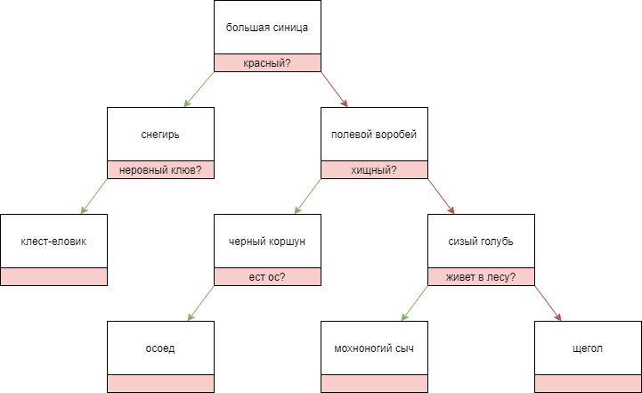

# birdguesser

### Описание

Игра "угадай животное" с птицами вместо животных.

Поддерживает режимы поиска ответа и обучения. "Выученные" птицы сохраняются в базу знаний.

Каждый раз, когда программа предлагает птицу в качестве ответа, можно просмотреть, как был получен этот ответ.

В конце каждого раунда также есть возможность просмотреть все содержимое базы знаний или найти информацию о конкретной
птице.

### Установка/запуск

```
cd <...>/birdguesser-master
npm install
node index.js
```

### Реализация

Вся база знаний программы хранится в одном json-файле как бинарное дерево, представленное в виде массива.

В качестве ответа всегда предлагается птица из ```i```-го элемента массива.
Если загадана другая птица, программа задает вопрос из ```i```-го элемента массива и в зависимости от ответа переходит к
элементу ```2i+1``` (да) или элементу ```2i+2``` (нет).

Если на очередной итерации в ```i```-м элементе нет птицы/вопроса, программа "сдается". 

### Дополнительно

При первом запуске программы в базе есть только ```большая синица```.

Чтобы протестировать режим поиска ответа на готовых данных,
замените содержимое файла ```src/data.json``` на данные из файла ```src/data-7.json```.

Данные в ```src/data-7.json``` соответствуют такому бинарному дереву:



